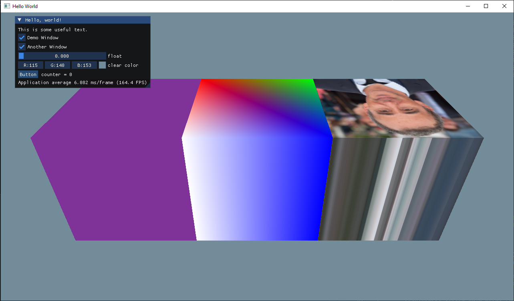

# Sprint 2 ( october 22 - november 5 )

## What happened during this sprint?

- Created the first graphics component (cube)
    - working with color and texture

First sample scene with 3 cubes using color and texture

- Implemented 2 basic Colliders
    - Box
    - Sphere
- Implemented Collision detector
    - SAT (Separate Axis Theorem)
- Developed test