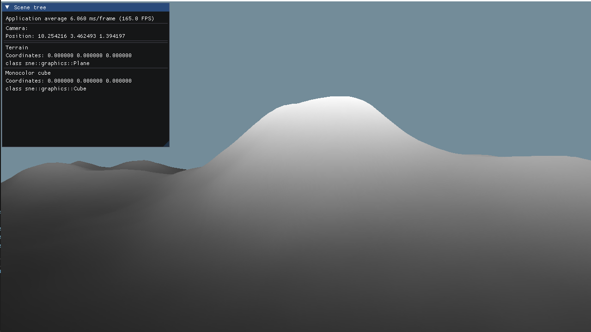

# Sprint 3 ( november 5 - november 19 )

For the graphic part, we created a layer of abstraction for EBO, VAO, VBO, and the draw call to accelerate the process of creating future graphics objects. 

We created a Plane Graphic Component where we can defined its width, depth and density. Then , for terrain generation, we created a shader that uses an heightmap to change the y coordinate of every vertices .

As far away vertices are not visible in the screen, we decided to implement Tessellation to improve performance on GPU usage and GPU memory.  Performance numbers will be recorded in the future.

([https://www.khronos.org/opengl/wiki/tessellation](https://www.khronos.org/opengl/wiki/tessellation))

Then we implement a basic texturing method and directionnal diffuse lighting model:

For physic part we added the basic kinematics and forces applyied to an object. 
We can now observe changes time after time and also apply reaction when 2 objects collides. There are 2 kind of collisions, collisions between 2 mobile objects, or with a fixed one. 
If it is fix, we apply an ‘amortissement’ coefficient simulating elastic (or not) collision (means conservation of energy, ex: ball bouncing on the grown).