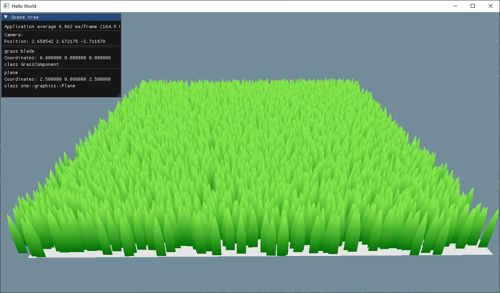

# Sprint 5 ( december 3 - december 17 )

## What happened during this sprint?

First Step for grass generation:

- Instancing
- Basic movement simulating wind

- Finalisation of physic interaction calcul
- Physic Manager with Optimization for collision detection (Sweep & Prune)